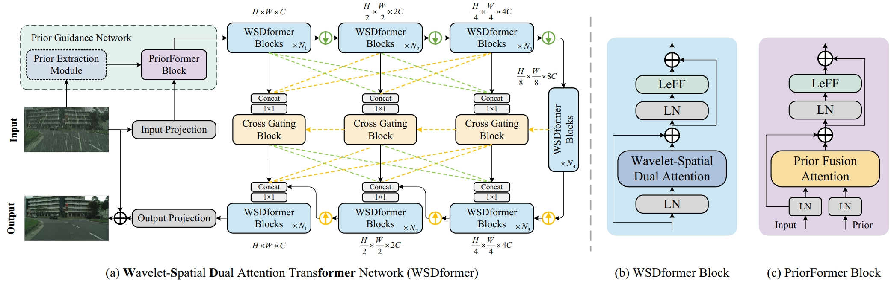
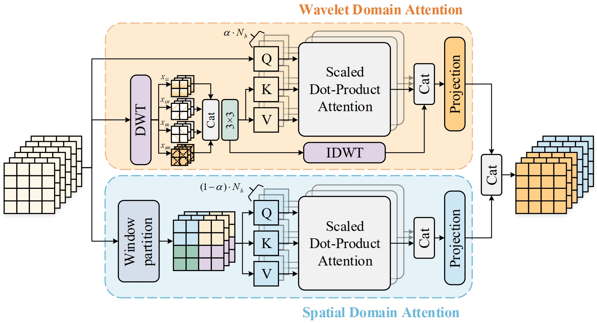
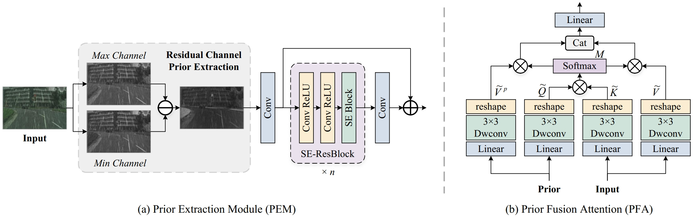

# A Prior Guided Wavelet-Spatial Dual Attention Transformer Framework for Heavy Rain Image Restoration (IEEE TMM 2024)
Ronghui Zhang, Jiongze Yu, Junzhou Chen, Guofa Li, Liang Lin, Danwei Wang

> **Abstract:** *Heavy rain significantly reduces image visibility, hindering tasks like autonomous driving and video surveillance. Many existing rain removal methods, while effective in light rain, falter under heavy rain due to their reliance on purely spatial features. Recognizing this challenge, we introduce the Wavelet-Spatial Dual Attention Transformer Framework (WSDformer). This innovative architecture adeptly captures both frequency and spatial characteristics, anchored by the wavelet-spatial dual attention (WSDA) mechanism. While the spatial attention zeroes in on intricate local details, the wavelet attention leverages wavelet decomposition to encompass diverse frequency information, augmenting the spatial representations. Furthermore, addressing the persistent issue of incomplete structural detail restoration, we integrate the PriorFormer Block (PFB). This unique module, underpinned by the Prior Fusion Attention (PFA), synergizes residual channel prior features with input features, thereby enhancing background structures and guiding precise rain feature extraction. To navigate the intrinsic constraints of U-shaped transformers, such as semantic discontinuities and subdued multi-scale interactions from skip connections, our Cross Interaction U-Shaped Transformer Network is introduced. This design empowers superior semantic layers to streamline the extraction of their lower-tier counterparts, optimizing network learning. Empirical analysis reveals our method's leading prowess across rainy image datasets and achieves state-of-the-art performance, with notable supremacy in heavy rainfall conditions. This superiority extends to diverse visual challenges and real-world rainy scenarios, affirming its broad applicability and robustness. The source code is available at https://github.com/Jiongze-Yu/WSDformer.*

## Method

**WSDformer architecture.** (a) shows the overall architecture of **W**avelet-**S**patial **D**ual Trans**former** Network (WSDformer), where the green and yellow arrows represent down-sampling and up-sampling, respectively. (b) shows the internal structure of the WSDformer Block, and (c) shows the internal structure of the PriorFormer Block.

The structure of Wavelet-Spatial Dual Attention.

**The components of Prior Guidance Network.** (a) shows the structure of the Prior Extraction Module (PEM), which uses the residual channel as the prior information. (b) shows the structure of Prior Fusion Attention (PFA) in the PriorFormer Block (PFB).

## Datasets
<table>
<thead>
  <tr>
    <th>Dataset</th>
    <th>Outdoor-rain</th>
    <th>Rain200L</th>
    <th>Rain200H</th>
    <th>DID-Data</th>
    <th>DDN-Data</th>
    <th>SPA-Data</th>
    <th>Rain100L</th>
    <th>Rain100H</th>
    <th>Cityscapes-rain</th>
  </tr>
</thead>
<tbody>
  <tr>
    <td>Baidu Cloud</td>
    <td> <a href="">Download </a> </td>
    <td> <a href="">Download </a> </td>
    <td> <a href="">Download </a> </td>
    <td> <a href="">Download </a> </td>
    <td> <a href="">Download </a> </td>
    <td> <a href="">Download </a> </td>
    <td> <a href="">Download </a> </td>
    <td> <a href="">Download </a> </td>
    <td> <a href="">Download </a> </td>
  </tr>
</tbody>
</table>
